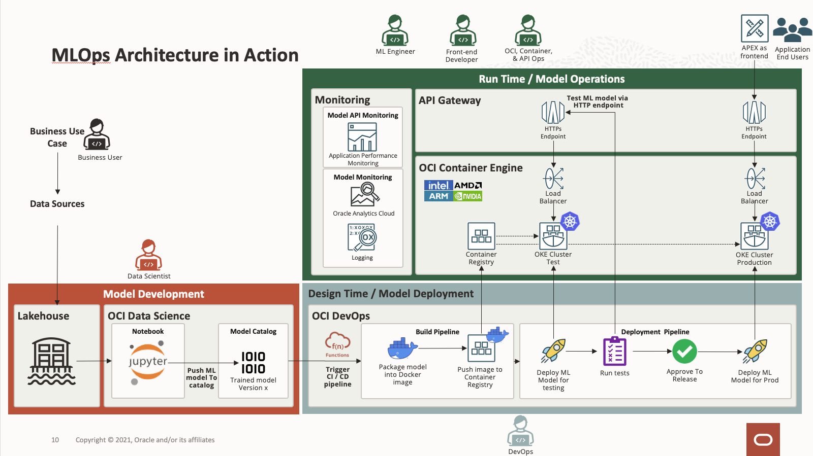

# oci-developer-incubator-mlops

 

## THIS IS A NEW, REPO THAT IS NOT READY FOR USE YET.  PLEASE CHECK BACK SOON!

## Introduction
MLOps is a set of practices and tools that combine the principles of DevOps with machine learning workflows. It aims to streamline and automate the deployment, monitoring, and management of machine learning models in production environments.
Key components of MLOPS include version control, continuous integration/continuous deployment (CI/CD), infrastructure management, experiment tracking, model registry, monitoring and alerting, model governance, and scalability.
Advantages of MLOPS:
Increase productivity through automation.
Enhanced reliability and stability of model deployment.
Time to market for new models and features was accelerated.
Improved scalability to handle increasing data and estimation demands.
Better collaboration, transparency and compliance between teams.

We have covered end to end MLOps life cycle.
There are three cycles that work in conjunction in MLOps
I. Model Development
II. Model Deployment
III. Model Operations

Cycle 1 – is Model Development and includes tasks such as:
1.Defining Business Use Case: Understanding the business challenges & requirement. 
2.Have the right training data available. Oracle Lakehouse on OCI is the perfect starting point for this, I encourage you to watch my colleague Vas Kuhaluri Cloud Byte session on the topic of “Unlock the Value of Data Faster with a Lakehouse and Data Mesh Architecture” for more details. It is available on-demand.
3.Next is Data Exploration & Preparation: Here, the Data Scientists team explores and prepares data as needed to fix potential issues like: Missing Values, Duplicated data, Invalid data, Noise, …
4.Then comes Feature Engineering & Selection:  Here Data Scientists use domain knowledge to extract meaningful information from raw data and select the features that contribute the most to your prediction / output to improve the performance of machine learning (ML) algorithms.
5.Model Training & Evaluation: Here, Data Scientists split the dataset in training & testing datasets, select appropriate algorithm, do hyperparameter tuning and compute performance metrics to assess the accuracy of a model on test data. 
6.Final outcome of this cycle is a Candidate Model: Once these steps are completed the best candidate model is selected by comparing multiple models on the basis of accuracy parameters.

Cycle 2 is Model Deployment: This requires coordination between data scientist, Data Engineer AND DevOps engineer
Model Deployment involves tasks such as:
1.CI/CD pipeline: This is the process to put candidate models into production. Data Scientist package the machine learning model and store it in model catalog. DevOps engineer creates the CI/CD pipeline to automate the build, test and deployment in production. 
2.Endpoint Identification is required to deploy machine library models as web applications (HTTP API endpoints) in order to execute predictions in real time (this is the most common way that models are productionized). DevOps engineer use API gateway to register API and made it available to consume by end users in a secured way. 
3.Parameter & Integration testing: It is important that Parameter & integration tests are run before the ML model reaches the production environment. Data Scientist & DevOps engineer will create a fully automated test that regularly triggers the entire ML pipeline. The test validates that the data and code successfully finish each stage of training and the resulting ML model performs as expected.

Third cycle is Model Operations: 
Here - Application developer integrates the ML model to end user web or mobile application in batch processing or real time inferences. 
Model Monitoring is about tracking model performance and identifying any signs of serving skew where model performance degrades below desired score/accuracy 
Model Retraining: In a UK bank survey from August 2020, 35% of asked bankers reported a negative impact on ML model performance because of the pandemic. Unpredictable events like this are a great example of why continuous training and monitoring of ML models in production is important compared to static validation and testing techniques. 
We can retrain model based on many triggers. Such as:
1.Data Drift: It’s an obvious fact that data is generated at every moment in the world. As data is collected from multiple sources, data itself is changing. If the input distribution changes then this kind of change is considered as data drift.If there’s a change in the output classes of your model. This means we’re detecting the effect of concept drift.
2.Model Drift : if there’s a change in the relationship between input & output ( target classes) of your model. This means we’re detecting the effect of Model drift.
3.KPI Drift : After deploying your model in production, you need to determine your baseline metric score. In this approach, a trigger for a rebuild is due to the model performance degrading in production.
4.Scheduled (time based): Wondering how to schedule your model retraining – weekly, monthly, or yearly? Well, periodic training is the most intuitive and straightforward approach to retraining your model. 

## **Architecture Diagram**

## Getting Started
This terraform stack deploys OCI resources needed to operationalize ML models using MLOps methodology for bank loan application use case. Data Scientists will be able to develop and train ML models using OCI Data Science and manage the ML models using Model Catalog. When a new model is committed to Model Catalog, OCI DevOps build pipeline will be triggered automatically to package the ML model into container then the model will be deployed and tested in the test OKE environement before publishing to production enviroment when it's approved by a release manager. The API GW will be interfacing with the model endpoint and served as public endpoint for external integration. APEX is used as the frontend for bank loan application and the **Smart Approval** feature makes use of the ML model to predict the eligibility of the loan.

### Prerequisites
1. Users with `"manage"` permission for the resources listed in this [section](#deployed-resources).
2. Enough service limits and quota in the tenancy and compartment.
3. Create auth token. Refer to this [link](https://docs.oracle.com/en-us/iaas/Content/Identity/Tasks/managingcredentials.htm#create_swift_password)
4. Convert auth token to base64 using this [link](https://www.base64encode.org/)
5. **[Optional]** Obtain IDSC access token from IDSC Admin Portal for OAC deployment.
6. Please update the email & region according to your tenancy region in the Terraform file.
7. The datasets need to upload in object storage & run the notebook to save model in OCI data science Model catalog. This will start deveops pipeline for model deployment.
8. Rest API will be available in API Gateway once model pipeline completed successfully. 

## **Deploy Using OCI Resource Manager**

Click the button to deploy to OCI.

## **Deployed Resources** 

These OCI resources will be deployed by this stack:
- Core Resources
    - VCN x3
    - Internet GW x3
    - Service GW x2
    - NAT GW x2
    - Route Table x5
    - Subnets x7
    - Security List x6
- Kubernetes
    - OKE cluster x2
    - OKE node pool x2
- ADB x1
- API
    - API GW x2
    - API Deployment x2
- APM
    - APM Domain x1
    - Synthetics Monitor x2
- Container Registry x3
- Data Science
    - Data Science Project x1
    - Data Science Notenbook Session x1
- DevOps
    - DevOps Project x1
    - Environment x3
    - Artifacts x4
    - Code Repository x1
    - Build Pipeline x1
    - Build Stages x2
    - Deployment Pipeline x1
    - Deployment Stages x5
- Events x1
- Functions
    - Application x2
    - Functions x2
- Oracle Analytic Cloud x1
- Object Storage
    - Bucket x1
    - Object x2
- KMS
    - Vault x1
    - Key x1
- Vault secret x1

## Notes/Issues

## URLs
* Nothing at this time

## Contributing
This project is open source.  Please submit your contributions by forking this repository and submitting a pull request!  Oracle appreciates any contributions that are made by the open source community.

## License
Copyright (c) 2022 Oracle and/or its affiliates.

Licensed under the Universal Permissive License (UPL), Version 1.0.

See [LICENSE](LICENSE) for more details.

ORACLE AND ITS AFFILIATES DO NOT PROVIDE ANY WARRANTY WHATSOEVER, EXPRESS OR IMPLIED, FOR ANY SOFTWARE, MATERIAL OR CONTENT OF ANY KIND CONTAINED OR PRODUCED WITHIN THIS REPOSITORY, AND IN PARTICULAR SPECIFICALLY DISCLAIM ANY AND ALL IMPLIED WARRANTIES OF TITLE, NON-INFRINGEMENT, MERCHANTABILITY, AND FITNESS FOR A PARTICULAR PURPOSE.  FURTHERMORE, ORACLE AND ITS AFFILIATES DO NOT REPRESENT THAT ANY CUSTOMARY SECURITY REVIEW HAS BEEN PERFORMED WITH RESPECT TO ANY SOFTWARE, MATERIAL OR CONTENT CONTAINED OR PRODUCED WITHIN THIS REPOSITORY. IN ADDITION, AND WITHOUT LIMITING THE FOREGOING, THIRD PARTIES MAY HAVE POSTED SOFTWARE, MATERIAL OR CONTENT TO THIS REPOSITORY WITHOUT ANY REVIEW. USE AT YOUR OWN RISK. 